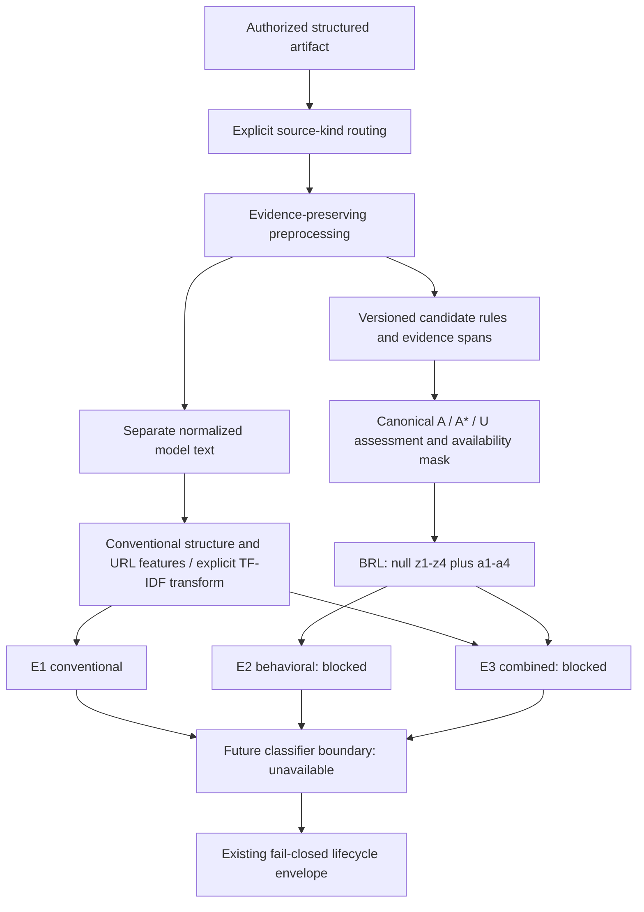

# SE-BRL pre-training analytical pipeline

This is **pre-training infrastructure**, not a completed SE-BRL model. No dataset,
ground truth, classifier, calibrated output, confidence, threshold, evaluation,
or SHAP attribution is supplied. Rules emit **rule-based evidence** only.
The canonical codebook and result-envelope JSON documents remain unchanged.



## Modules and usage

- `ml/preprocessing.py`: validated structured input, source routing, static HTML
  parser, original text and link locators, independent normalized model text.
- `ml/features.py`: deterministic metadata/structure/URL feature extraction,
  explicit word/character TF-IDF fit/transform, split manifest, E1/E2/E3 builders.
- `ml/se_brl/rules.py`: immutable rule definitions and ruleset version `0.2.0`.
- `ml/se_brl/extraction.py`: canonical indicator results, traceable evidence,
  quotation/negation safeguards, dimension assessment through the existing resolver.
- `ml/se_brl/representation.py`: canonical ordering and null learned slots; no
  substitution of counts or Boolean observations for probabilities.
- `ml/models.py`: classifier/trainer protocols, candidate algorithm IDs, validated
  training-input preparation, and an explicitly unavailable model boundary.
- `ml/pipeline.py`: internal orchestration; never fits, trains, or predicts.
- `ml/se_brl/context.py` and `detectors.py`: indexed context guards and independent
  evidence interfaces for authority, impersonation, and brand exploitation.
- `ml/datasets.py` and `grouping.py`: canonical corpus-adapter records, separate
  source/behavior labels, provenance, and validation of supplied grouped splits.
- `ml/feature_schema.py`, `feature_storage.py`, and `metadata.py`: reproducible
  feature configuration manifests and immutable sparse-compatible mappings.
- `ml/readiness.py`: factual stage readiness with research dependencies.

```python
from ml.pipeline import PretrainingPipeline

result = PretrainingPipeline().run({
    "kind": "email",
    "subject": "Please submit your password immediately.",
    "sender": "Example <sender@example.test>",
})
assert result.envelope.overall_status == "not_evaluated"
assert result.representation.z_values == (None, None, None, None)
```

Use `backend.app.sebrl_adapter.to_sebrl_api_response(result.envelope)` only for
canonical-modality envelopes. Unsupported source kinds return a domain-only
`review_required` envelope with modality `unknown`; the existing API deliberately
rejects that sentinel. Internal evidence is never added to the wire envelope.
No endpoint, persistence, extension collection, or dashboard behavior changes.

## Input, evidence, and privacy

Input is a mapping with explicit `kind`: `email`, `webpage`, `url`, or `technical`.
This is source routing, not a classifier. Ambiguous/mixed-source fields are
rejected. Technical records cannot carry email/HTML content under another label.

Email fields are `subject`, `body`, `sender`, `reply_to`, and `headers`. Bodies
require strict `body_collection_authorized=True` **and** a nonempty
`study_purpose`. This offline boundary does not enable body collection in Gmail.
Header names are allowlisted: Date, Message-ID, In-Reply-To, References, and
Content-Type. Authentication/session headers, attachments, and arbitrary metadata
are rejected. Inputs must already be lawfully obtained, minimized research
artifacts; this module is not a secret detector or a transport authorizer.

Webpages accept `html` or `visible_text`, optional `title`, and optional `page_url`.
They are never fetched or executed. Text from script/style/template/noscript,
hidden nodes, textarea values, and obvious inline CSS hiding is excluded.
Only structural tag names, positions, and type/method attributes are retained;
input values, event handlers, and arbitrary data attributes are not retained.
Supplied text is not guaranteed to be credential-free: callers must not provide
real credentials, session material, or populated forms as research inputs.

`urls` and text/HTML link extraction require strict
`link_extraction_authorized=True`. A directly supplied `url` or `page_url` is the
artifact's own locator, not link extraction. HTTP(S) URLs with embedded userinfo
are rejected. Query strings may contain sensitive data: upstream collection must
exclude secret-bearing URLs. No URL is fetched. Relative HTML links resolve only
against a supplied page URL; unresolved relative links are not lexical features.
HTML base tags do not override the supplied provenance URL.

Evidence spans use half-open Python Unicode **character** offsets, not UTF-8 bytes
or JavaScript UTF-16 indices, in the named original field. Plain text spans satisfy
`original[start:end] == evidence.text`. HTML text retains entity spelling; NFKC,
entity decoding, case folding, and whitespace collapse happen only in model text.
There is intentionally no claim that normalized offsets map directly to evidence.
Link evidence identifies exact text or an enclosing start tag plus attribute
location; it never fabricates precise attribute offsets. Tag paths use deterministic
parser node indices and are source locators, not browser CSS selectors.

Leading `>` lines and recognizable `On ... wrote:` / original/forwarded-message
tails are retained as quoted evidence but excluded from model text and rules.
HTML blockquotes are likewise excluded. These heuristics need corpus validation.

## Candidate rules and interpretation

The registry implements nine canonical indicator families:

| Dimension | Implemented candidate rules | Deferred detectors |
| --- | --- | --- |
| Pressure and Threat Cues | urgency, fear_threat, scarcity | none |
| Lure and Attention Cues | curiosity, reward_lure | none |
| Trust and Identity Manipulation | confidentiality_isolation | authority, impersonation, brand_exploitation |
| Requested Action and Consequence | call_to_action, credential_sensitive_data_request, financial_action_request | none |

All twelve results use canonical IDs and parent mappings loaded from the codebook.
The three trust detectors now have independent-evidence interfaces in addition
to the nine text-rule families. They remain `not_evaluated` with
`evidence_state=None` when required independent references are missing. `None` is
a detector placeholder, **not** an added canonical evidence state. The table's
deferred column refers to autonomous detection without those references.

`supported` means a candidate rule found qualifying surface evidence; `absent`
means no implemented rule matched within its limited scope; neither establishes
ground truth. `unavailable` follows the existing content and conditional-evidence
rules. Dimension observations are the OR of retained indicator evidence, passed
to the unchanged assessment resolver. An `absent` dimension is not a claim that
all possible indicators were exhaustively or reliably assessed: inspect the
indicator evaluation statuses, especially deferred trust detectors. Availability
describes evidence opportunity, not detector coverage or model readiness.

Rules require phrases/actions rather than isolated words such as “password”.
Sentence-level negation, nearby educational/scam examples, reported speech,
quotations, and quoted replies suppress matches. Nearby guards inspect at most
320 characters on either side of a match; these are parsing bounds, not model
thresholds. Punctuation and quotation ranges are indexed once per field rather
than rescanned for every match. The confidentiality rule permits its own negative
instruction (“do not contact your bank”). Multiple spans and cross-indicator
overlap are retained with provenance; exact duplicate rule/span hits are removed.
No aggregation into a behavioral score occurs.

These narrow English patterns favor abstention, have unknown error rates, and are
not a final validated instrument. They cannot establish deceptive intent or
verify legitimate promotions. Rules match original text segments; split phrases
across HTML inline nodes or entities may be missed, although negation context
spans adjacent nodes. Static HTML parsing cannot reproduce external CSS,
JavaScript rendering, browser error recovery, image text, or screenshots. It is
not a visibility oracle. Empty/quoted-only content is unavailable; a subject or
title alone counts as limited assessable content and does not imply body access.

## Features, leakage controls, and model boundaries

Conventional features include normalized text length/word count; sender/reply-to
domain presence and difference; header, quotation, tag, form, input, password-input,
and link-element counts; URL length, digits, HTTP usage, IP hosts, hostname-label
counts, and query presence. Missingness indicators accompany content, sender,
reply-to, body, HTML, and link-collection availability. These are technical
features, not risk scores. No behavioral inference is made from standalone URLs.

Word TF-IDF defaults to unigrams/bigrams; character TF-IDF uses lengths 3–5.
The implementation uses raw term counts, smoothed IDF
`log((1+n)/(1+df))+1`, and L2 normalization. Terms are sorted deterministically.
Unseen terms do not change the vocabulary or IDF. An all-empty training corpus
has zero text columns. No fitting occurs in pipeline execution.

`SplitManifest` requires disjoint train/validation/test record IDs. `fit` requires
exactly its training IDs; refitting a TF-IDF extractor requires a new instance.
Every E1/E2/E3 build uses the same prepared artifact and representation. Future
cross-validation must instantiate fresh builders inside each fold and share the
same split manifest across configurations. IDs cannot prove source independence:
duplicate, campaign, participant, temporal, and source leakage audits still need
dataset provenance. The dependency-free vectorizer materializes dense mappings;
the numerical TF-IDF implementation remains dense. `SparseFeatureValues` and
`CombinedFeatureValues` now provide an immutable Mapping boundary preserving
E1/E2/E3 contracts without adding scipy. Missing z values remain explicit `None`;
omitted conventional sparse entries mean zero. This is a storage seam, not a
production sparse vectorizer. The existing training-input convenience function
still produces dense rows; a future sparse trainer can consume the mappings.

The default unfitted conventional builder returns structural values plus explicit
missing-TF-IDF reasons. A deliberate `include_tfidf=False` configuration yields
only deterministic conventional features; it is not the full text-feature E1.
The BRL slots are `[None, None, None, None, a1, a2, a3, a4]`. E2 and E3 cannot
pass `require_numeric()` until a future validated behavioral implementation is
added. Rule counts are never substituted for `z` values. The future training-input
validator checks record IDs, labels, identical feature schemas/configurations,
and numeric readiness, without fitting any classifier.

Logistic Regression, Linear SVM, Random Forest, and XGBoost are candidate IDs
behind common protocols only. There are no estimator dependencies or trained
artifacts. Class labels/margins, behavioral probabilities, and final calibrated
phishing probabilities remain distinct contracts to implement later.

## Independent trust evidence

`DetectorContext` is an optional, typed argument to `RuleEngine.extract` and
`PretrainingPipeline.run`. References are separate from artifact text. No brand
registry is invented or fetched, and source phishing labels are never used here.
Reference IDs must point to an independent, documented audit; the software can
validate their structure and artifact linkage, not authenticate the audit itself.
Do not populate them by copying an artifact's self-assertions.

| Indicator | Required evidence | Conservative outcome |
| --- | --- | --- |
| authority | Exact role invocation plus a following directive in the same sentence; an `AuthorityReview` links both spans to an independent authorization reference | Role mention alone produces no candidate. Role + directive without a review is retained as an observation, with `not_evaluated`. An authorized review excludes it; contradicted authorization permits candidate rule evidence. Unknown authorization abstains. |
| impersonation | `IdentityReference` containing an explicit claim span, entity, independently audited exact authorized domains, reference ID, and `delegation_audited=True`; a parsable sender/reply-to domain or webpage's own URL | No reference or incomplete delivery/delegation audit means `not_evaluated`. A domain conflict produces candidate evidence with the claim and observed identity fields. Aligned fields mean no conflict was observed, not proven legitimacy. |
| brand_exploitation | The same independent identity evidence, explicitly scoped to `brand_exploitation` | A brand mention is insufficient. A claim and independently observable domain conflict are both required. |

Explicit identity claim forms are deliberately narrow: “We are ENTITY”, “This is
ENTITY”, “Official notice from ENTITY”, and “On behalf of ENTITY”. References
must select the exact original span, not normalized text. Domain comparison uses
exact lowercase ASCII/punycode host membership, never suffix similarity or an
invented official-brand domain. Audits must enumerate authorized hosts, including
delegated delivery/reply domains; no public-suffix or DNS inference occurs.
Sender/reply-to differences alone remain conventional technical features.

Authority role patterns are limited to explicit invocations such as “As your
administrator” and “By order of the manager”, followed by an action. Legitimacy
is deliberately not inferred from role language. Reviews are bounded to 64 per
reference category, validated against the current artifact, and cannot contain
duplicate/conflicting reviews of the same span. Partial identity or authority
reviews cannot silently mark unreviewed candidates absent. Shared context guards
apply to every trust detector. Modality/A* masking also applies to their reports,
so unavailable trust evidence never leaks qualifying findings through diagnostics.

Findings preserve the primary span, additional supporting spans, detector ID,
ruleset version, modality, and independent reference ID. They are candidate
rule evidence, not validated behavioral ground truth or estimates of deception.

## Dataset and grouping boundary

`DatasetAdapter.adapt` is a protocol for future corpus-specific loaders. No corpus
loader or download exists. `DatasetRecord` retains `record_id`, `source_dataset`,
optional `source_record_id`, canonical modality/artifact input, exact supplied
`fields_available`, declared content availability (`None` means unaudited), source
phishing label, known group IDs, provenance, and optional source metadata.
Nested metadata is frozen and must contain finite JSON values. Body/link
authorization controls remain unchanged; an adapter must never infer consent from
dataset membership. Empty supplied fields count as supplied, not as content.

`prepare_record` validates the record against the existing preprocessor.
`PretrainingPipeline.run_record` preprocesses once, retains provenance alongside
the internal result, and keeps it out of the existing API envelope. Contradictory
content declarations are rejected. Labels and metadata are never included in
artifact model text or conventional features.

`SourcePhishingLabel(PhishingLabel, source_reference)` is separate from
`BehavioralAnnotation(BehavioralLabel, evidence_reference)` and the canonical,
versioned `BehavioralGroundTruth` container. Runtime validation rejects phishing
labels, strings, and Booleans where a behavioral label is required. A partial
annotation set does not mark omitted indicators absent. No source phishing label
is converted into any of the twelve behavioral labels.

`GroupIdentifier` records a kind, audit namespace, and group ID. Supported kinds
are duplicate cluster, email thread, campaign, domain family, and source family.
No groups are inferred. `GroupAwareManifest` wraps the existing `SplitManifest`,
requires explicit metadata entries for every split record, and rejects protected
groups crossing partitions or contradictory per-record assignments. Empty tuples
record unknown groups. `missing_group_metadata` reports unresolved audit work;
`require_complete()` rejects it. Callers explicitly select the protected kinds
appropriate to an experiment, and must use consistent namespaces across related
sources. These checks validate supplied assertions, not whether an audit missed
duplicates or campaigns. No partitioning algorithm is run or provided here.

## Reproducibility and readiness

Preprocessing and ruleset versions are now `0.2.0` because reply/context handling
changed. The canonical codebook and lifecycle/API contract versions are unchanged.
`FeatureBundle.schema` records preprocessing, conventional and TF-IDF configuration,
codebook/ruleset versions, and E1/E2/E3 configuration. `FeatureSchema.to_json()` /
`from_json()` round-trip a small versioned manifest; `configuration_id` is its
deterministic SHA-256 fingerprint. TF-IDF fit signatures include vocabulary/IDF,
the split manifest, and hashes of training text. Only the digest enters feature
configuration metadata, not vocabulary terms or artifact text. Fitted state
properties are read-only; changing analyzer/ngram settings after fit is rejected.
No trained classifier is serialized. Unfitted state is explicitly null. A custom
extractor without configuration metadata remains explicitly unreported, not
implicitly equivalent to the default builder. Training-input validation rejects
different schemas even if their feature column names happen to match.

```python
from ml.pipeline import PretrainingPipeline

pipeline = PretrainingPipeline()
report = pipeline.readiness().to_dict()
# Optionally inspect the same stages for a concrete run:
result = pipeline.run({"kind": "email", "subject": "Hello"})
run_report = pipeline.readiness(result).to_dict()
```

This internal readiness report is separate from the unchanged API result envelope.
It reports implemented preprocessing/conventional features/group validation/schema
infrastructure, partial candidate detection, structural dataset adapters/E1, missing
behavioral ground truth, untrained behavioral/classifier/calibration stages,
E2/E3 blocked by z values, unavailable SHAP, and unfrozen decision rules. Each
stage records applicable dataset, ground-truth, independent-evidence, training,
or validation dependencies. E1 can report ready for numeric features under an
explicit configuration (including structural-only); this never promotes the
classifier to trained. Invalid inputs restrict run-level readiness. There are
no completion percentages or fabricated research outputs.

Invalid schemas and parser failures produce safe review envelopes. Expected
component operational failures produce `failed` without exception details or
partial model inputs. Unexpected programming errors propagate so defects are
visible; they never produce fallback predictions. Unreadable/incompatible
canonical contracts also raise rather than manufacturing an envelope. Valid
preparation returns `not_evaluated`; behavior identification in the lifecycle
contract remains incomplete because candidate rules are not a validated model.

## Required next research work

Freeze rule operational definitions and annotation guidelines against independent
ground truth; review exclusions, false positives/negatives, quotation handling,
language coverage, partial-content assumptions, and identity evidence. Establish
dataset provenance and grouped split manifests, then fit features only inside
training folds. Implement and validate behavioral models for z1–z4 before E2/E3
experiments. Next: datasets → ground truth → training → E1/E2/E3 experiments →
model comparison → calibration → selected model → SHAP → decision/intervention →
final MVP integration. None of those research results are claimed here.

Run deterministic fixtures (not datasets or evaluation experiments):

```powershell
.venv\Scripts\python -m pytest ml/tests backend/tests -q -p no:cacheprovider
```
